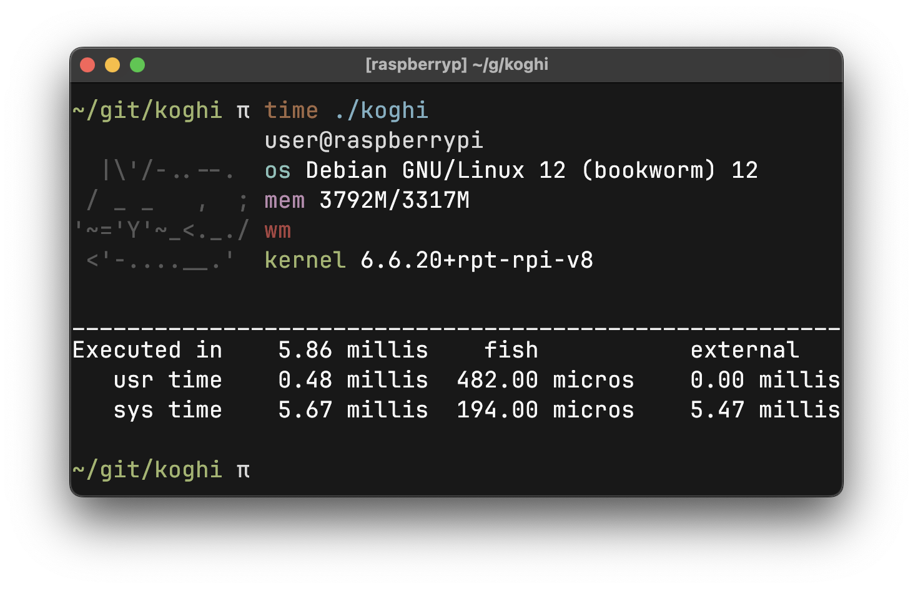

# koghi - a silly fast fetch in go

yo just look at this
FIFTEEN ms under linux?? it's literally the same time as if you were to run `fd` on the project directory. it's not even funny at this point

and it works on mac too!!


## how to use
requirements: ``go 1.21``

```bash
# compile
go build
# to install it just copy it to any of your path dirs
go build && sudo cp ./koghi /usr/bin/
```
NixOS users: you'll probably want to replace the paths in util.go

## configuration
all the config is managed in `main.go` for speed and simplicity!!
for this guide, use the search in your IDE
if there's a variable definition, it probably goes into the start of main.go or instead of the variables it's referencing (whatever fits you more)

### modify and add lines
```go
// label: obvious
// format: each %s stands for a value in return []any{...data}, you can add extra characters for formatting
// dataFunc: getters for values
// return []any{...data}:
{
	label:  "userHost",
	format: "%s@%s",
	dataFunc: func() []any {
		username, _ := getUser()
		hostname, _ := hostname()
		return []any{username, hostname}
	},
},
```

### change the theme a little
```go
conf.theme.cyan = "\x1b[38;5;51m" // different cyan
conf.theme.red = "\x1b[38;5;196m" // custom red
```

### add a whole new theme
```go
var dracula = Theme{
    bold:   "\x1b[1m",
    white:  "\x1b[0m \x1b[1m\x1b[97m",
    cyan:   "\x1b[38;5;87m",
    purple: "\x1b[38;5;141m",
    red:    "\x1b[38;5;167m",
    green:  "\x1b[38;5;114m",
}
conf.theme = dracula
```

### arch: package count
on by default, counts packages on arch, does nothing otherwise
```go
conf.countPkg = false // disable package counting
```

### custom WM name
wayland doesn't really do the whole "easy to fetch wm name" thing
```go
conf.presetWMName = "Hyprland" // set a custom WM name
```

### custom ascii
```go
var ascii = `
  |\'/-..--.
 / _ _   ,  ;
'~='Y'~_<._./
 <'-....__.'
`
```

then, set the padding. it has to be at least as wide as the ascii art. 20 is prolly enough for everything but who knows
```go
const asciiWidth = 20
```

---

## contributing:
please

## ldd output:
this is so statically linked its insane
```
linux-vdso.so.1 (0x0000007f97a65000)
libc.so.6 => /lib/aarch64-linux-gnu/libc.so.6 (0x0000007f97870000)
/lib/ld-linux-aarch64.so.1 (0x0000007f97a28000)
```
