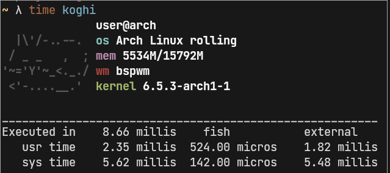

# koghi - a rly simple fetch in go

compile is ``go build``  
install is ``go build && sudo cp ./koghi /usr/bin/``
reqs: just go, works on p much all linux machines with no external libraries (except for getting ur window manager from X11)

