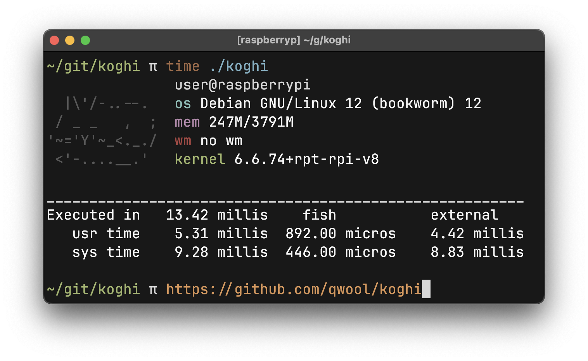

# koghi - a silly fast fetch in go

yo just look at this
FIVE ms under linux?? it's literally the same time as if you were to run ls. its not even funny at this poimt

and it works on mac too!!

> dasd aa desd
> asdfasdfasf
> bambam
> asdfasdf
> edad balsl
> AAAAAAAAA
> ababababa
> asdfasdf

## how to use
requirements: ``go 1.21``

```bash
# compile
go build
# to install it just copy it to any of your path dirs
go build && sudo cp ./koghi /usr/bin/
```

## configuration
for all the config check main.go!!
you could customize it like this:
```go
conf.theme.cyan = "\x1b[38;5;51m" // different blue
conf.format.userHost = "→ %s%s@%s" // add arrow to first line
```

or make whole new themes:
```go
var dracula = Theme{
    // dracula colors here
}
conf.theme = dracula
```

you can change your wm name (incase youre on wayland) and toggle arch package fetching
also you obviously can change ascii art
file paths are in util.go if you need to change anything


ldd output:
```
linux-vdso.so.1
libc.so.6 => /usr/lib/libc.so.6
/lib64/ld-linux-x86-64.so.2 => /usr/lib64/ld-linux-x86-64.so.2
```
